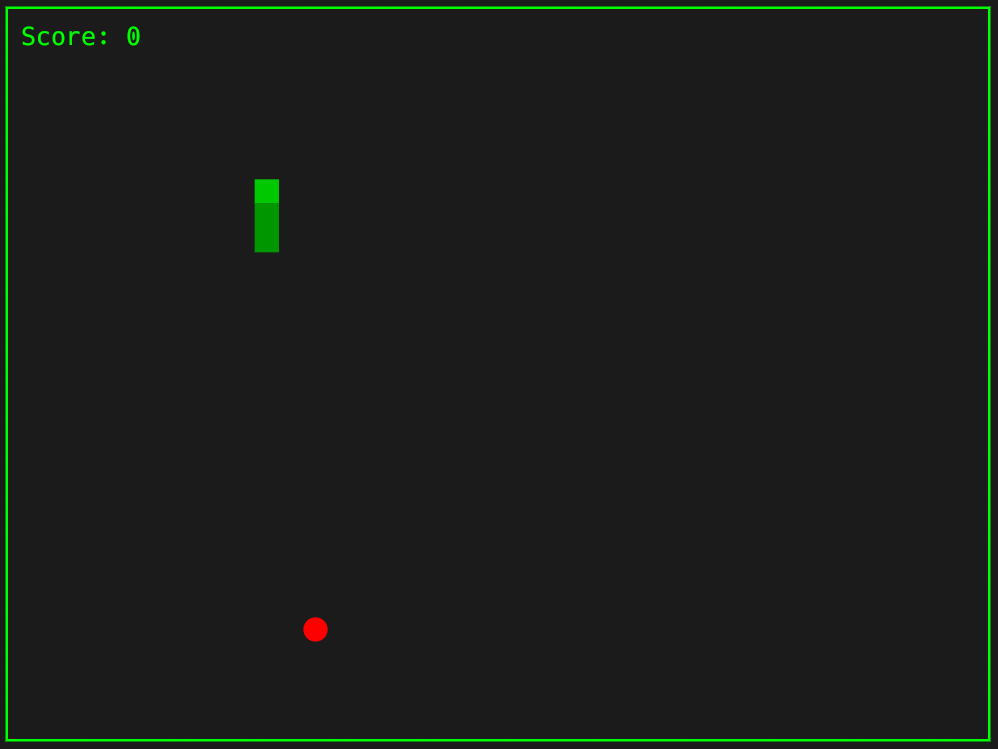

A simple yet nostalgic Retro Snake Game built with Rust. Inspired by the classic snake game we all grew up playing, this version brings back the retro feel.

## 🎯Features##
# 🕹 Classic Gameplay# – Eat food to grow your snake.

💥 Game Over on self-collision or hitting walls (optional free-bound mode).

🎨 Retro Look – Pixelated style and simple color palette.

## 📸 Screenshots ##

  

## 🎮 How to Play ##
Start the Game – Run the program using the instructions below.

# Controls:#

⬆ Up Arrow – Move Up

⬇ Down Arrow – Move Down

⬅ Left Arrow – Move Left

➡ Right Arrow – Move Right

#Objective:

Eat the food (■) to grow longer.

Avoid colliding with yourself or walls.

Winning: Survive and grow as much as possible!

## ⚙️ Installation & Running##

git clone https://github.com/upanshi-mittal/Bitsnake.git
cd Bitsnake
# Run the Game#
cargo build
cargo run

#📜 License#
This project is licensed under the MIT License – feel free to use and modify it.